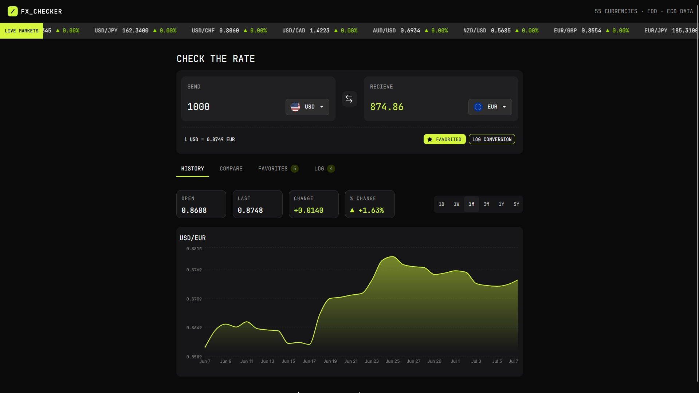
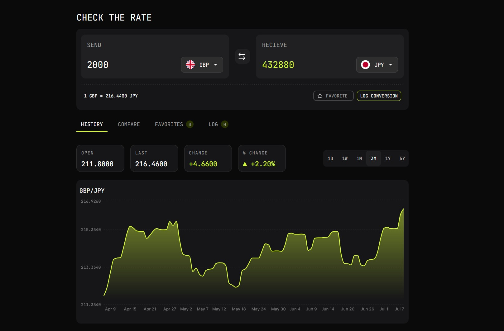
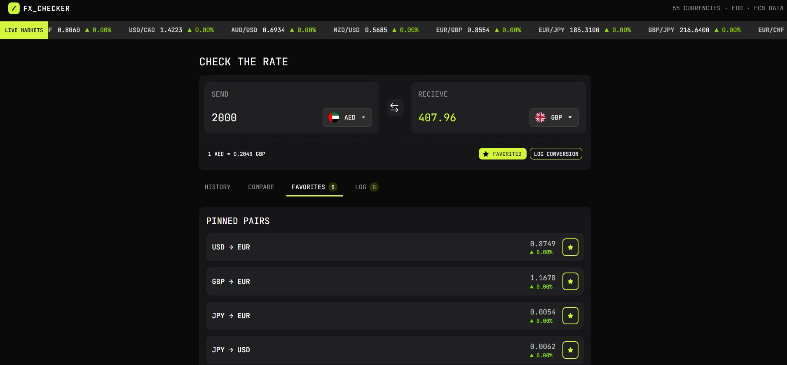
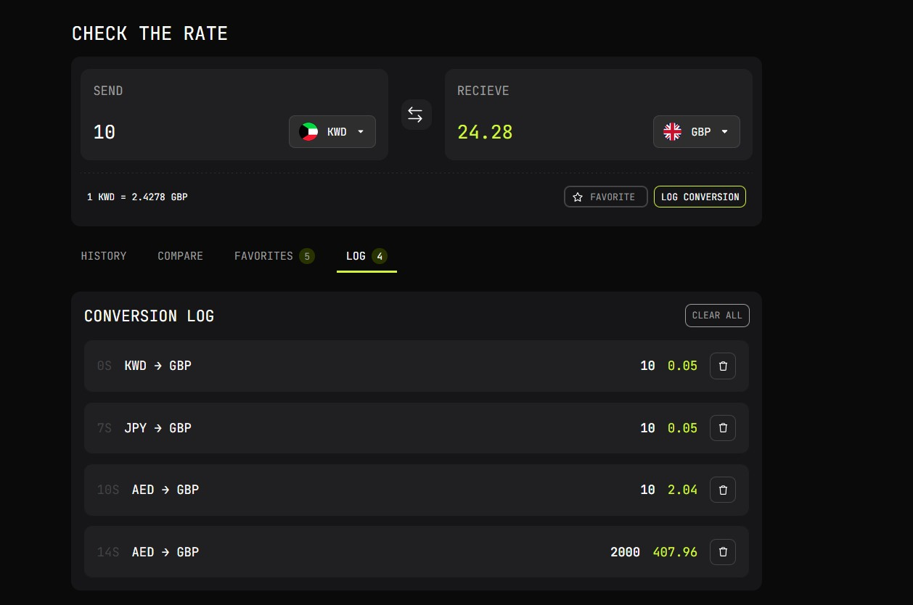
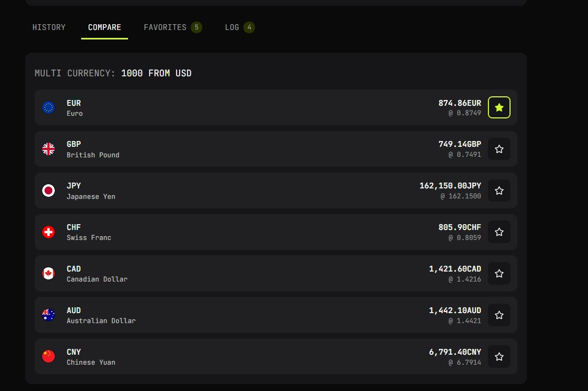

# Frontend Mentor - FX Checker solution

This is a solution to the [FX Checker challenge on Frontend Mentor](https://www.frontendmentor.io/challenges/foreign-exchange-currency-converter). Frontend Mentor challenges help you improve your coding skills by building realistic projects.

## Table of contents

- [Overview](#overview)
  - [App Breakdown](#app-breakdown)
  - [Screenshot](#screenshot)
  - [Links](#links)
- [My process](#my-process)
  - [Built with](#built-with)
  - [What I learned](#what-i-learned)
  - [Continued development](#continued-development)
  - [Useful resources](#useful-resources)
  - [AI Collaboration](#ai-collaboration)
- [Author](#author)
- [Acknowledgments](#acknowledgments)

## Overview

Completed the initial React + Vite application setup with Tailwind CSS and established a modular component architecture.

Core structure:

App.jsx
Converter.jsx
TabsBar.jsx
Dropdown.jsx
Header.jsx
Footer.jsx
Live.jsx
History.jsx
Compare.jsx
Favorites.jsx
Log.jsx

Implemented a mobile-first responsive layout with desktop enhancements.

#### API Integration

Integrated the Frankfurter API.

Implemented:

- Currency list retrieval
- Live exchange rates
- Currency conversion
- Historical exchange rate endpoint
- Market ticker endpoint
- Error handling
- Loading states
- Debounced conversion requests

### App Breakdown

#### Converter

- Enter an amount to send and see the converted value update in real time as you type
- Choose the "Send" and "Receive" currencies from a searchable dropdown with country flags
- View the live exchange rate for the selected pair (for example, 1 USD = 0.8530 EUR)
- Instantly swap the selected currencies with a single click
- Save the active currency pair to Favorites for quick access later
- Log any conversion to a persistent conversion history stored locally
- Display loading and error states while exchange rates are being retrieved
- Debounce API requests to provide a smoother user experience and reduce unnecessary network calls

#### Currency picker

- Dropdown of the full list of available currencies by code or name
- Currencies grouped into "Popular" and "Others", each row showing the flag, code, and name
- Conversion against the currency that's currently selected

#### Live Market Ticker

- Display continuously scrolling exchange rates using a custom CSS ticker
- Show twelve major currency pairs simultaneously
- Display live exchange rates for every pair
- Indicate daily market movement using percentage changes
- Highlight positive and negative movements with directional indicators
- Gracefully handle unsupported currency pairs without interrupting the remaining ticker items

#### History

- View historical exchange rate performance for the selected currency pair
- Switch between predefined time ranges (1D, 1W, 1M, 3M, 1Y, and 5Y)
- Explore an interactive area chart built with [Recharts](https://recharts.github.io/)
- View opening rate, latest rate, absolute change, and percentage change
- Automatically refresh the chart whenever the selected currencies or time range change
- Smoothly scroll to the chart when switching between historical ranges
- Dynamically scale the chart axes based on available data

#### Compare

- Compare the selected base currency against eight major world currencies
- Display both the currency code and full currency name
- Show country flags for each comparison currency
- Calculate converted amounts using the current input value in real time
- Display the latest exchange rate for every comparison pair
- Highlight currency pairs that have already been added to Favorites
- Indicate the currently selected destination currency
- Quickly switch the active conversion by selecting any comparison row
- Lazily load exchange rates to improve perceived performance

#### Favorites

- Save frequently used currency pairs for quick access
- Persist favorite pairs using Local Storage
- Display country flags for every saved currency pair
- Load a saved pair directly into the converter with a single click
- Remove favorite pairs instantly without refreshing the application
- Show live conversion values for every saved pair
- Display the latest exchange rate for each favorite
- Indicate daily market movement with gain or loss percentages
- Synchronize changes immediately across the entire application

#### Conversion Log

- Record conversions including source currency, destination currency, amount, converted value, and timestamp
- Persist conversion history using Local Storage
- Display the most recent conversions first
- Show relative timestamps (for example, 20M, 3H, 2D, 1Y)
- Remove individual conversion entries
- Clear the entire conversion history with a single action
- Automatically synchronize changes across all components

#### General Application

- Fully responsive interface optimized for both desktop and mobile devices
- Centralized state management using React hooks
- Persistent application data using Local Storage
- Modular component architecture for maintainability
- Graceful handling of loading, network, and API errors
- Real-time updates across all application sections without requiring page refreshes
- Optimized API usage through debounced requests and lazy-loaded data where appropri

#### UI & accessibility

- View the optimal layout for the interface depending on their device's screen size
- See hover and focus states for all interactive elements on the page
- Navigate the entire app using only their keyboard

### Screenshot

#### Home



#### History



#### Favourites



#### Conversion Log



#### Compare



#### Links

- Solution URL: [Add solution URL here](https://your-solution-url.com)
- Live Site URL: [Add live site URL here](https://currency-converter-app-frankfurter.netlify.app/)

## My process

### Built with

- Semantic HTML5 markup
- CSS custom properties
- Flexbox
- CSS Grid
- Mobile-first workflow
- React
- Tailwind CSS
- Recharts for History

### What I learned

This project evolved well beyond a simple currency converter and became an opportunity to build a larger React application with shared state, persistent storage, data visualization, and reusable components.

Some of the key concepts I strengthened throughout the project include:

- Managing shared application state by lifting data into `App.jsx` and passing it down through props instead of relying on individual component state.
- Persisting user data such as favorites and conversion history with Local Storage while keeping React state as the single source of truth.
- Working with multiple REST API endpoints to retrieve live exchange rates, historical data, and market information.
- Building interactive data visualizations using Recharts and dynamically scaling charts based on incoming data.
- Optimizing API usage with debouncing, lazy loading, and asynchronous requests using `Promise.all()`.
- Creating reusable components that remain responsive across both desktop and mobile layouts.
- Handling unsupported API responses gracefully without interrupting the rest of the application.
- Designing a modular React architecture that makes new features easy to integrate.

One implementation I'm particularly happy with is centralizing favorites and conversion history in React state while synchronizing them automatically with Local Storage.

```js
const [favorites, setFavorites] = useState([]);
const [conversionLog, setConversionLog] = useState([]);

useEffect(() => {
  localStorage.setItem("favorites", JSON.stringify(favorites));
}, [favorites]);

useEffect(() => {
  localStorage.setItem("conversionLog", JSON.stringify(conversionLog));
}, [conversionLog]);
```

This approach eliminated synchronization issues between components and ensured every part of the application updated immediately.

### Continued development

Going forward, I'd like to continue improving both performance and user experience by focusing on:

- Implementing request caching to reduce unnecessary API calls.
- Expanding the comparison dashboard to support user-selected currencies instead of fixed presets.
- Adding sorting and filtering to Favorites and Conversion Log.
- Exploring React Context or Zustand for larger-scale state management.
- Adding automated testing with Vitest and React Testing Library.
- Improving accessibility with better keyboard navigation and screen reader support.
- Exploring animations and micro-interactions to create a more polished user experience.

### Useful resources

- https://frankfurter.dev/ - The exchange rate API used throughout the project for live conversions and historical data.
- https://recharts.org/ - Excellent documentation for building responsive charts and customizing chart components.
- https://react.dev/ - The official React documentation was invaluable for hooks, effects, and state management best practices.
- https://tailwindcss.com/docs - Used extensively while building the responsive interface and reusable utility classes.

### AI Collaboration

ChatGPT was used as a development assistant throughout the project rather than a code generator.

It helped with:

- Debugging React rendering and state synchronization issues.
- Refactoring components into a cleaner architecture.
- Brainstorming UI and UX improvements.
- Reviewing component structure for better maintainability.
- Suggesting performance optimizations such as lazy loading and debouncing.
- Solving Local Storage synchronization issues.
- Generating reusable utility functions.
- Discussing implementation approaches before writing production code.

The most valuable aspect of using AI was rapid iteration. Instead of searching through multiple documentation pages, I could quickly validate implementation ideas, troubleshoot bugs, and explore alternative approaches while still making the architectural decisions myself.

## Author

- Frontend Mentor - https://www.frontendmentor.io/profile/mmuneeb1000
- GitHub - https://github.com/mmuneeb1000
- LinkedIn - https://www.linkedin.com/in/m-muneeb-a9984633b/

## Acknowledgments

Thanks to the Frontend Mentor community for providing realistic project briefs that encourage building production-style applications instead of isolated UI components. The Frankfurter API made it possible to work with live financial data, and the React and Tailwind CSS documentation were invaluable references throughout development.
